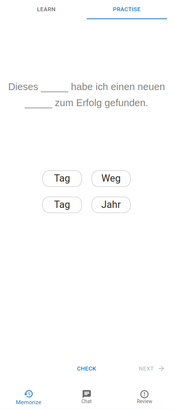
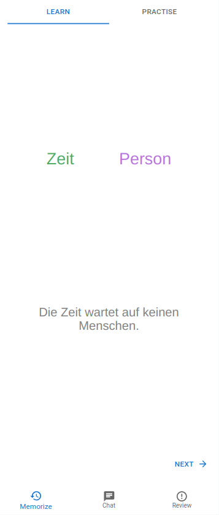

# Language acquisition (front-end)

This web application is specifically designed for language learning. It has been developed using React.js and utilizes Material-UI for its user interface design.

<table style="width: 100%;" bgcolor="#f0f0f0">
    <tr>
        <td style="text-align: center;">
            
        </td>
        <td style="width: 20px; background-color: #f0f0f0;"></td>
        <td style="text-align: center;">
            
        </td>
    </tr>
</table>

## Getting Started

Follow these instructions to get a copy of the project up and running on your local machine for development and testing purposes.

### Prerequisites

- Node.js & npm (Node Package Manager) installed on your machine.

### Installation

1. Clone the repository:

    ```bash
    git clone <repository-url>
    ```

2. Navigate to the project directory:

    ```bash
    cd la_frontend
    ```

3. Install dependencies:

    ```bash
    npm install
    ```

### Development

To start the development server, run:

```bash
npm start
